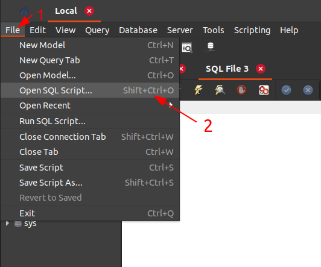
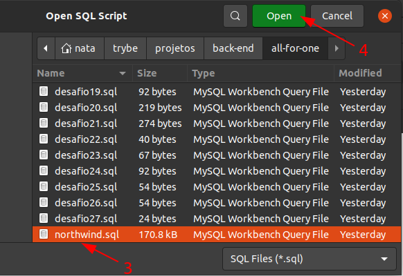
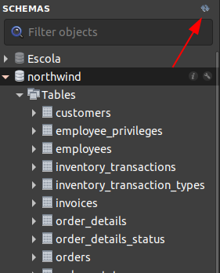
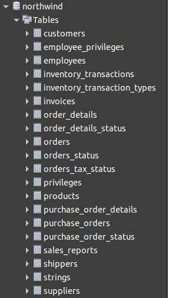
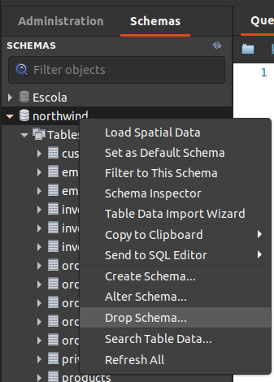

# All For One

## Descrição

Este projeto trata-se de uma série de desafios que foram solucionados utilizando queries em SQL, principalmente por meio das instruções INSERT, SELECT, UPDATE, DELETE e suas cláusulas, para inserir, ler, atualizar e deletar registros das tabelas de um banco de dados relacional.

## Tecnologias utilizadas

O projeto foi desenvolvido utilizando apenas MySQL.

## Instalação das dependências

Para executar as queries, é necessário realizar a instalação do [MySQL Server](https://dev.mysql.com/downloads/mysql/) e do [MySQL Workbench](https://dev.mysql.com/downloads/workbench/).

## Como executar

Primeiramente, é preciso restaurar o banco de dados `Northwind`.

### Restauração do banco de dados

1. Abra o MySQL Workbench;
2. Se conecte ao servidor;
3. Abra a opção de abrir um script SQL:

    

4. Selecione o arquivo `northwind.sql` e abra-o:

    

5. Execute o script clicando no ícone de raio:

    

6. Aguarde alguns segundos até que todas as instruções sejam executadas;
7. Atualize a lista de banco de dados:

    

7. Verifique se o banco restaurado possui todas as seguintes tabelas:

    

8. Certifique-se que todas as tabelas estão populadas clicando com o botão direito em cada tabela e selecionando "Select Rows". Caso haja alguma tabela que não possua dados, realize o passo a seguir;

9. Remova o banco de dados, como mostra a imagem abaixo, e refaça todos os passos.

    

### Execução das queries dos desafios

Após a restauração do banco de dados `Northwind`, basta abrir e executar cada arquivo `desafioN.sql`, da mesma forma como foi feito com o arquivo `northwind.sql` no passo a passo anterior.

## Requisitos (desafios)

Os requisitos abaixo foram todos providos pela [Trybe](https://www.betrybe.com).

### 1 - Exiba apenas os nomes dos produtos na tabela `products`.

### 2 - Exiba os dados de todas as colunas da tabela `products`.

### 3 - Escreva uma query que exiba os valores da coluna que representa a primary key da tabela `products`.

### 4 - Conte quantos registros existem na coluna `product_name` da tabela `products`.
### 5 - Monte uma query que exiba os dados da tabela `products` a partir do quarto registro até o décimo terceiro.

**Observações técnicas**
 - Tanto o quarto quanto o décimo terceiro registros, precisam aparecer na consulta.
 - Não use `where` ou `order by`.

### 6 - Exiba os dados das colunas `product_name` e `id` da tabela `products` de maneira que os resultados estejam em ordem alfabética dos nomes.

### 7 - Mostre apenas os ids dos 5 últimos registros da tabela `products` (a ordernação deve ser baseada na coluna `id`).
### 8 - Faça uma consulta que retorne três colunas, respectivamente, com os nomes 'A', 'Trybe' e 'eh', e com valores referentes a soma de '5 + 6', a string 'de', a soma de '2 + 8'. 

**Observações técnicas**
 - Na primeira coluna, exiba a soma de `5 + 6` (essa soma deve ser realizada pelo SQL). 
 - Na segunda coluna deve haver a palavra \"de\". 
 - E por fim, na terceira coluna, exiba a soma de `2 + 8` (essa soma deve ser realizada pelo SQL). 
 - A primeira coluna deve se chamar \"A\", a segunda coluna deve se chamar \"Trybe\" e a terceira coluna deve se chamar \"eh\". 
 - Não use colunas pre-existentes, apenas o que for criado na hora.

### 9 - Mostre todos os valores de `notes` da tabela `purchase_orders` que não são nulos.

### 10 - Mostre todos os dados da tabela `purchase_orders` em ordem decrescente, ordenados por `created_by` em que o `created_by` é maior ou igual a 3.

**Observações técnicas**
 - Como critério de desempate para a ordenação, ordene também os resultados pelo `id` de forma crescente.

### 11 - Exiba os dados da coluna `notes` da tabela `purchase_orders` em que seu valor de `Purchase generated based on Order` é maior ou igual a 30 e menor ou igual a 39.

### 12 - Mostre as `submitted_date` de `purchase_orders` em que a `submitted_date` é do dia 26 de abril de 2006.

### 13 - Mostre o `supplier_id` das `purchase_orders` em que o `supplier_id` seja 1 ou 3.

### 14 - Mostre os resultados da coluna `supplier_id` da tabela `purchase_orders` em que o `supplier_id` seja maior ou igual a 1 e menor ou igual 3.

### 15 - Mostre somente as horas (sem os minutos e os segundos) da coluna `submitted_date` de todos registros da tabela `purchase_orders`.

**Observações técnicas**
 - Chame essa coluna de `submitted_hour`.

### 16 - Exiba a `submitted_date` das `purchase_orders` que estão entre `2006-01-26 00:00:00` e `2006-03-31 23:59:59`.

### 17 - Mostre os registros das colunas `id` e `supplier_id` das `purchase_orders` em que os `supplier_id` sejam tanto 1, ou 3, ou 5, ou 7.

### 18 - Mostre todos os registros de `purchase_orders` que tem o `supplier_id` igual a 3 e `status_id` igual a 2.

### 19 - Mostre a quantidade de pedidos que foram feitos na tabela `orders` pelo `employee_id` igual a 5 ou 6, e que foram enviados através do método(coluna) `shipper_id` igual a 2.

**Observações técnicas**
 - Chame a coluna de `orders_count`.

### 20 - Adicione à tabela `order_details` um registro com `order_id`: 69, `product_id`: 80, `quantity`: 15.0000, `unit_price`: 15.0000, `discount`: 0, `status_id`: 2, `date_allocated`: NULL, `purchase_order_id`: NULL e `inventory_id`: 129.

**Observações técnicas**
 - Obs.: o `id` deve ser incrementado automaticamente.

### 21 - Adicione com um único `INSERT`, duas linhas à tabela `order_details` com os mesmos dados do requisito 20.

**Observações técnicas**
 - Esses dados são novamente `order_id`: 69, `product_id`: 80, `quantity`: 15.0000, `unit_price`: 15.0000, `discount`: 0, `status_id`: 2, `date_allocated`: NULL, `purchase_order_id`: NULL e `inventory_id`: 129.
 - O `ìd` deve ser incrementado automaticamente.

### 22 - Atualize os dados de `discount` do `order_details` para 15. (Não é necessário utilizar o SAFE UPDATE em sua query).

### 23 - Atualize os dados da coluna `discount` da tabela `order_details` para 30, onde o valor na coluna `unit_price` seja menor que 10.0000.

**Observações técnicas**
 - Não é necessário utilizar o SAFE UPDATE em sua query.

### 24 - Atualize os dados da coluna `discount` da tabela `order_details` para 45, onde o valor na coluna `unit_price` seja maior que 10.0000 e o id seja um número entre 30 e 40.

**Observações técnicas**
 - Não é necessário utilizar o SAFE UPDATE em sua query.

### 25 - Delete todos os dados em que a `unit_price` da tabela `order_details` seja menor que 10.0000.

### 26 - Delete todos os dados em que a `unit_price` da tabela `order_details` seja maior que 10.0000.

### 27 - Delete todos os dados da tabela `order_details`.

---
